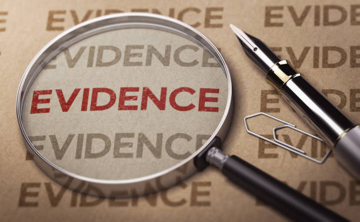

# The Visual Witness  
## YOLOv8 Forensic Image Analysis (TensorFlow Backend)

---

## 1. What is TensorFlow?

**TensorFlow** is an open-source machine learning framework developed by Google for building, training, and deploying deep learning models.

In this project, TensorFlow is used as the **inference backend** after converting the YOLOv8 model from PyTorch (`.pt`) format to **TensorFlow SavedModel** format. This ensures:

- Platform independence (CPU / GPU / TPU)
- Stable and reproducible forensic analysis
- Compatibility with enterprise and forensic-grade systems
- Long-term support and auditability

TensorFlow enables the automated analysis of images and extraction of meaningful object-detection results in a reliable and scalable manner.

---

## 2. Sample `test.jpg` Used for Analysis




## 3. Structured Output (Objects and Evidence Status)

The system generates a structured JSON-based output after detection and rule-based filtering.

### Class Configuration and Forensic Evidence List
```json
{
    "class_names": [
        "person", "bicycle", "car", "motorcycle", "airplane", "bus", "train", "truck", "boat", "traffic light",
        "fire hydrant", "stop sign", "parking meter", "bench", "bird", "cat", "dog", "horse", "sheep", "cow",
        "elephant", "bear", "zebra", "giraffe", "backpack", "umbrella", "handbag", "tie", "suitcase", "frisbee",
        "skis", "snowboard", "sports ball", "kite", "baseball bat", "baseball glove", "skateboard", "surfboard",
        "tennis racket", "bottle", "wine glass", "cup", "fork", "knife", "spoon", "bowl", "banana", "apple",
        "sandwich", "orange", "broccoli", "carrot", "hot dog", "pizza", "donut", "cake", "chair", "couch",
        "potted plant", "bed", "dining table", "toilet", "tv", "laptop", "mouse", "remote", "keyboard", "cell phone",
        "microwave", "oven", "toaster", "sink", "refrigerator", "book", "clock", "vase", "scissors", "teddy bear",
        "hair drier", "toothbrush"
    ],
    "forensic_evidence_list": [
        "cell phone",
        "knife",
        "laptop",
        "gun",
        "backpack"
    ]
}
